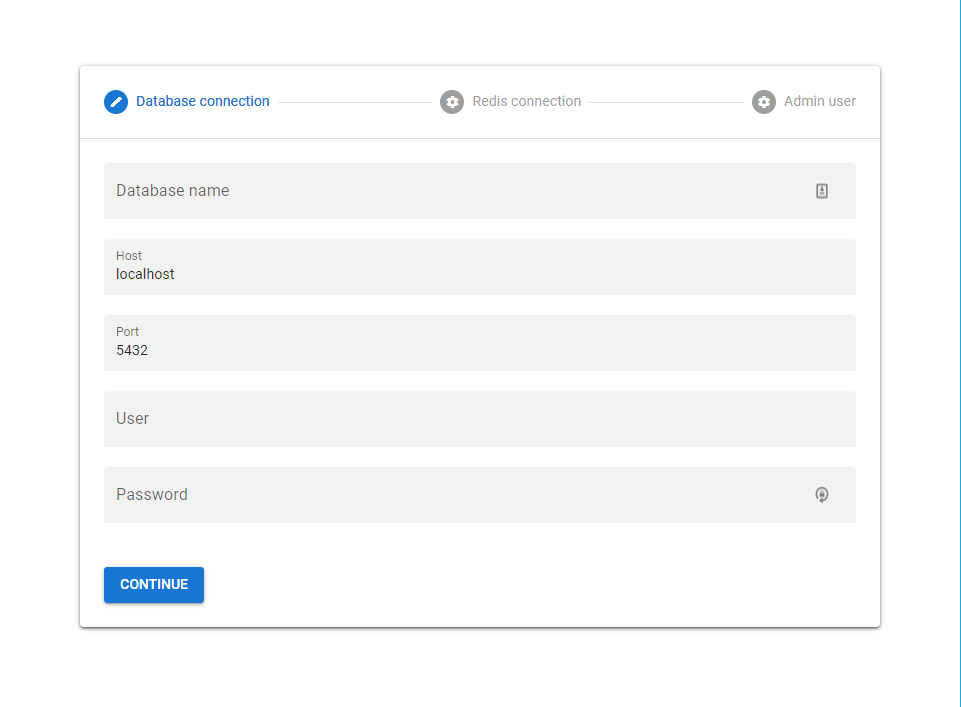

# Development setup

## Prerequisites

-   [Nodejs v14](https://nodejs.org/en/)
-   [Redis DB](https://redis.io/)
-   [Postgres DB](https://www.postgresql.org/)

## Installation

-   **Step 1**: clone the repository in github

```
git clone https://github.com/you-space/you-space.git
```

-   **Step 2**: install the dependence's of main project

```
npm install
```

-   **Step 3**: install the dependence's and build the dashboard of project

```
cd dashboard
yarn
yarn build
```

-   **Step 4**: run the app

```
npm run dev
```

-   **Step 5**: Go to [localhost:3333/setup](localhost:3333/setup) and configure the postgres connection, redis connection and define a admin user to access the dashboard



-   **Step 6**: And finally you can check the dashboard in [http://localhost:3333/ys-admin](http://localhost:3333/ys-admin)
