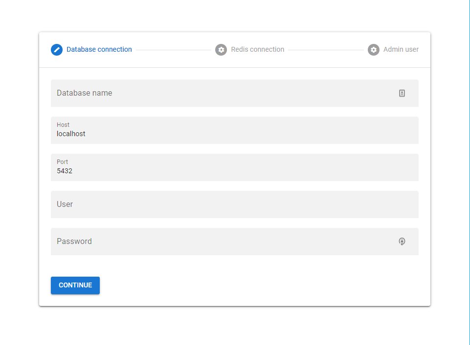

# Using build.zip file

## Prerequisites

-   [Node v14](https://nodejs.org/en/)
-   [Postgres v12](https://www.postgresql.org/)
-   [Redis](https://redis.io/)
-   Some tool to unzip the file like winrar, 7zip or unzip

## Installation

-   **Step 1**: Download the latest [build.zip](https://github.com/you-space/you-space/releases) file in our releases page.

-   **Step 2**: Unzip the build.zip

```
unzip build.zip -d ~/app && cd ~/app
```

-   **Step 3**: Install the dependencies

```
npm ci --production
```

-   **Step 4**: Start the application with:

```
node server.js
```

-   **Step 5**: Now you can access the setup page in [http://localhost:3333](http://localhost:3333) and configure the application.



-   **Step 6**: When finish the setup you can access the dashboard in [http://localhost:3333/ys-admin](http://localhost:3333/ys-admin)
