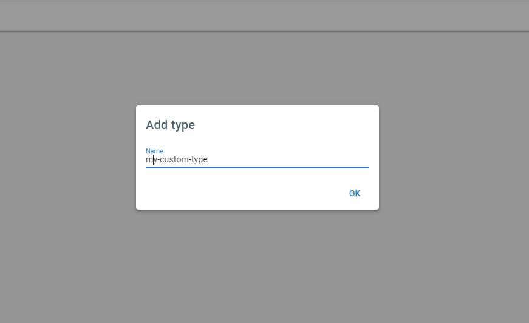
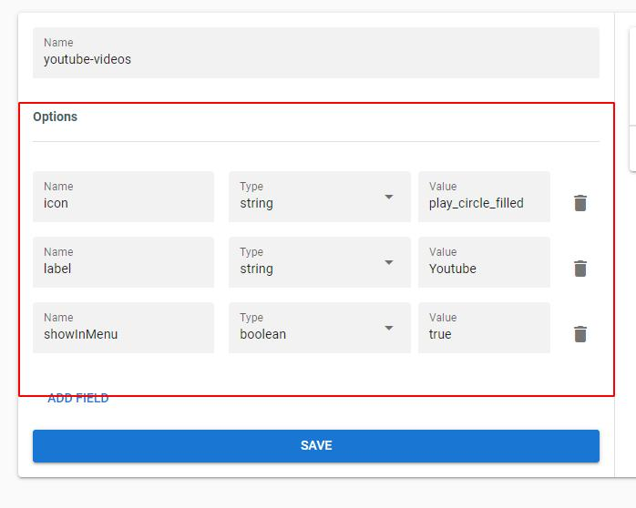
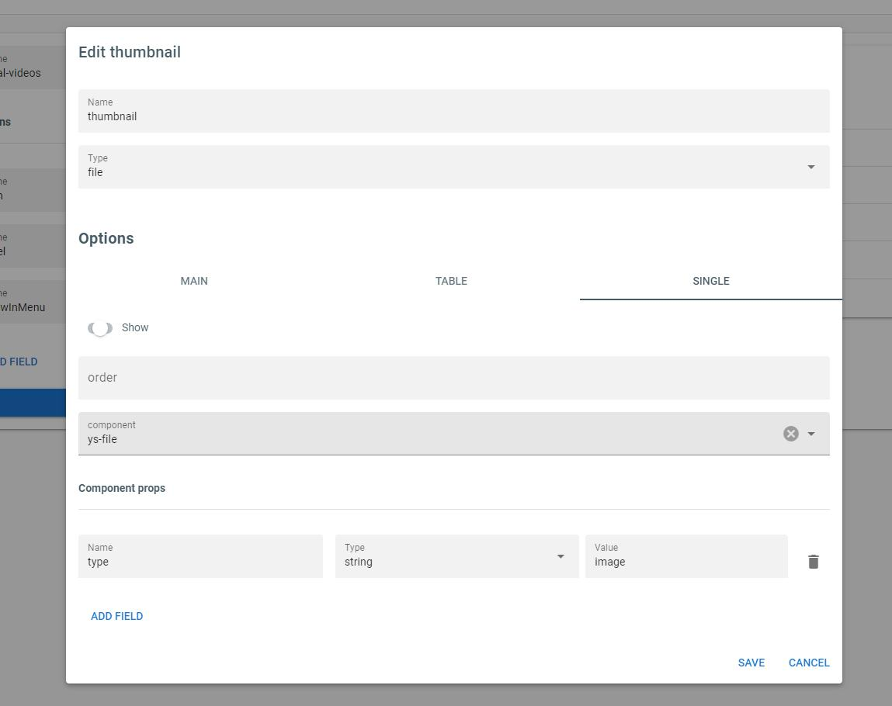

# How create a new type

This feature is still in tests and can be changed in the future, and just types with internal content can be created using this method.

## Create a new type

-   **Step 1**: Go to the types list page and click in the add-new button

-   **Step 2**: Choose a unique name for your type and click in ok to create the type

## Type options

In the type page you can configure the type options in left section, the available options are:

-   **icon**: name of [material-icon](https://fonts.google.com/icons) to use in dashboard menu
-   **label**: string to use in dashboard menu
-   **showInMenu**: boolean to show or hide the type items list page in dashboard menu

## Type fields

Also in the type page you can configure the fields.

-   **name**: is the name of field that can not contains spaces or any special character.
-   **type**: is the type of field, can be `editable` or `file`, also exist the type `mapped` but this one is used by origin providers.

-   **options**: is the options to control the behavior of field in dashboard, here you can define what component use for editing the values, props to pass to the component, show or hide him in table or single page, change the componente when is in table or single page, etc...

